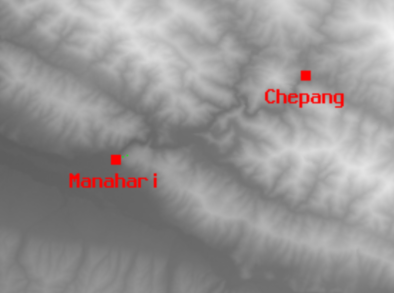
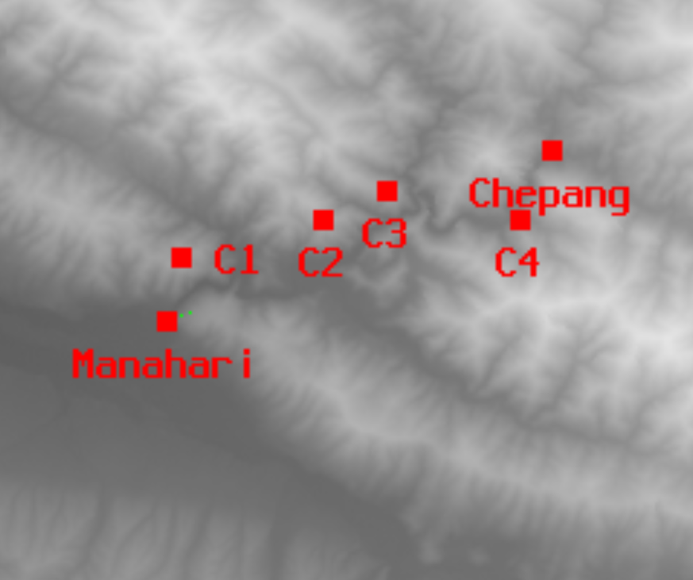
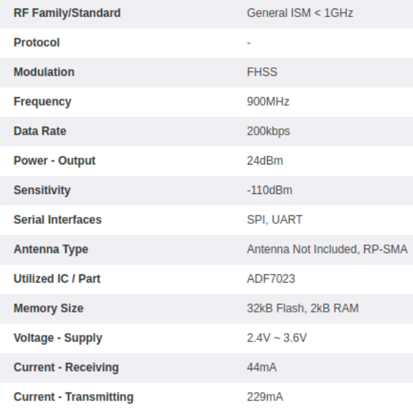
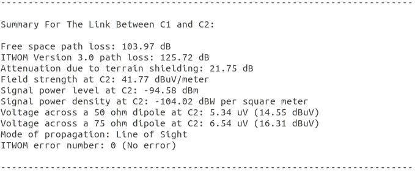
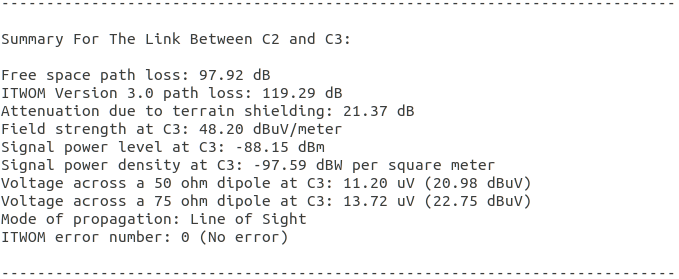
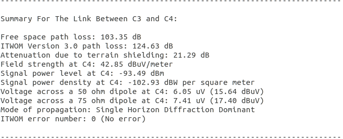

# Manahari to Chepang village Drone communication analysis using Splat!

```
Manahari :        (27.537682, 84.809433)  
Chepang Village : (27.588029, 84.920683)
Displacement ~ 13 Km
```


Between Chepang village and Manahari, due to non LOS conditions, 5 repeaters were added in splat! to facilitate LOS conditions for the entire path of drone.  
The repeaters are named as C1, C2, C3, C4, and C5 and the coordinates of repeaters are:  

```
C1: 27.555419, 84.813452
C2: 27.566498, 84.853922
C3: 27.575214, 84.872599
C4: 27.56631,  84.910746
C5: 27.581863, 84.913314
The antenna are placed 10m from ground
```


## Device used in repeaters and ground station:

The device used in ground station and repeaters is XBee Pro S3B 900HP. The product attribute of this device is shown below.  
  
From above given specification and using omnidirectional antenna of 5 dBi, ```ERP(Effective Radiated Power) was calculated to be 0.794328 Watts```

The XBee module says the maximum coverage distance under LOS conditions to be ```27 kms```.

## Coverage of repeaters
The LOS analysis was done in the splat with combination of repeaters C1,C2,C3,C4, and C5. The resultant LOS coverage is shown below.  
  
The results above shows LOS coverage without Manahari and Chepang village antennas due to limitation in number of transmitting site in splat!

```
The communication exists in the path, between drone and atleast one of station if the drone flies with a minimum height of 100m above the ground.
``` 

### Inter repeater analysis
Given that one repeaters lies within LOS of atleast one of repeaters, the individual analysis is shown below  
  
  
  
  

We can see that in each of summary link above the received power level is below XBee's receiver sensitivity i.e (below -110 dBm)
